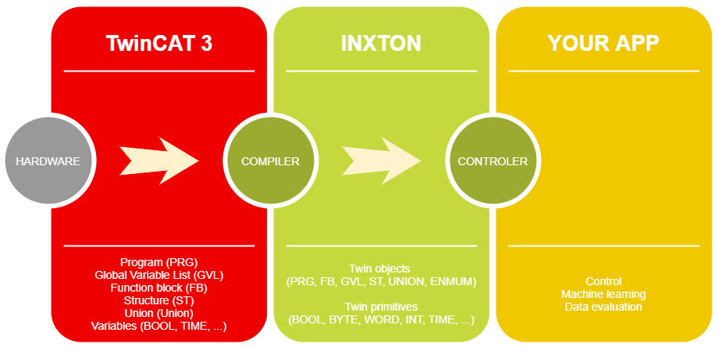
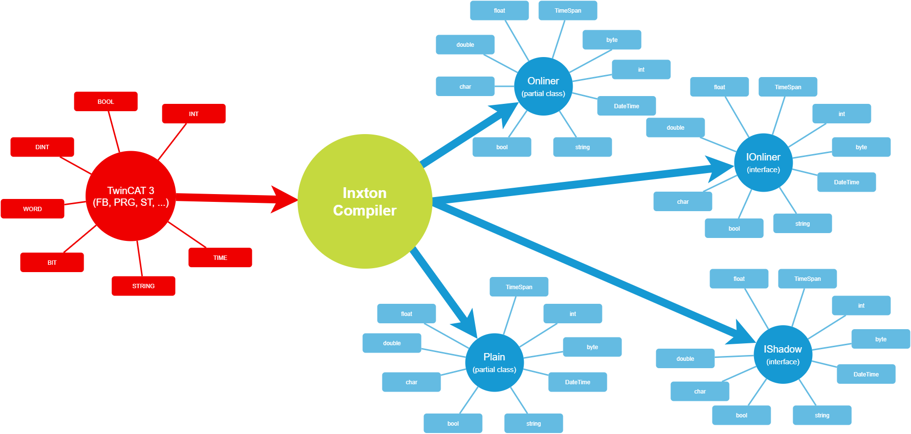
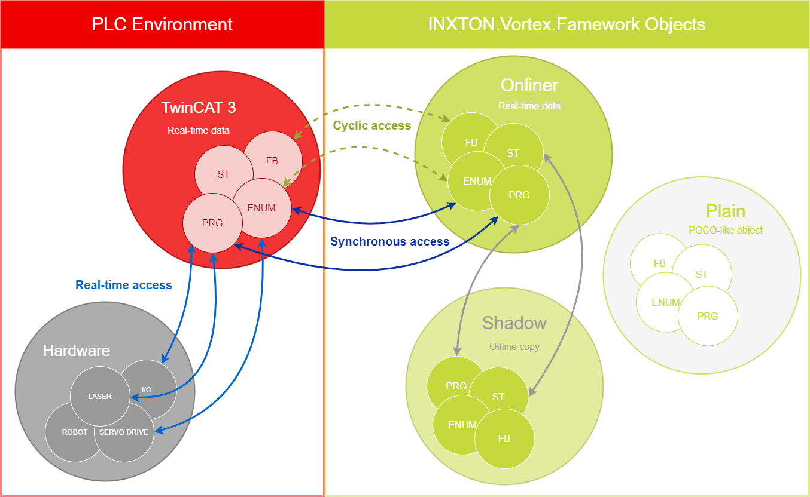

# Twin objects

Twin object is .net representation of a complex PLC data type (STRUCT, UNION, FB, GVL, PRG). Each of these data structures is represented by a separate class of which name is the same as the name of the respective structure.

Each twin object implements two types of interfaces  *IOnline* interface which exposes members with direct communication ability with the PLC system and IShadow interface with allows for an offline manipulation of object's data.

There is a separate class *Plainer* that is produced during the trans-piling process which is light (POCO like) representation of the same data structure, that can be is used in scenarios involving serialization.

## Compiler

Compiler supports PLC program structures of following POU types:

* [PROGRAM (PRG)](https://infosys.beckhoff.com/english.php?content=../content/1033/tc3_plc_intro/9007201785015179.html&id=930767890005286929)
* [GLOBAL VARIABLE TABLE (GVL)](https://infosys.beckhoff.com/english.php?content=../content/1033/tf1910_tc3_uml/36028798529893003.html&id=2773021788155373267)
* [STRUCTURE (STRUCT)](https://infosys.beckhoff.com/english.php?content=../content/1033/tcplccontrol/html/tcplcctrl_struct.htm&id=5127776672336114982)
* [ENUMERATION (ENUM)](https://infosys.beckhoff.com/english.php?content=../content/1033/tcplccontrol/html/tcplcctrl_enum.htm&id=4424143096508421991)
* [FUNCTION BLOCK (FB)](https://infosys.beckhoff.com/english.php?content=../content/1033/tc3_plc_intro/27021600294502539-2.html&id=186805786802053213)
* [UNION BLOCK (UNION)](https://infosys.beckhoff.com/english.php?content=../content/1033/tc3_plc_intro/18014401038903179.html&id=7589402540002750925)

Each of the mentioned is constructed and represented inside Inxton as several partial *Classes* plus corresponding *interfaces*. Please find more details in the sections below.

More about TwinCAT 3 data types can be found [here](https://infosys.beckhoff.com/english.php?content=../content/1033/tc3_plc_intro/126100792095762827.html&id=6124705676148460443).

><strong style="color:orange">NOTE</strong>: FUNCTION (FUN) are not compiled as the data of function block are temporary.

The compiler supports Members of POU declared in sections as well:
  * VAR
  * VAR_INPUT
  * VAR_OUTPUT

Read more about the nature of TwinCAT 3 variable types and special variables is available [here](https://infosys.beckhoff.com/english.php?content=../content/1033/tc3_plc_intro/72057596566677643.html&id=2442682616783122800).

><strong style="color:orange">NOTE</strong>: Sections VAR_IN_OUT, VAR_STAT, VAR_TEMP are not supported at this time. It should be also noted that variables declared in declaration sections of Methods and Functions are also not supported as they represent temporary variables. Variable in declaration sections of methods are not compiled even when declared within VAR_INST section.

## Object approach and naming convention
During the process of compilation, several partial classes and interfaces are being created. Each of the objects serves a specific purpose and its members are with a different relationship to PLC object.
Having a Function block named FbPiston created at PLC side. The result of the compiler's effort is Onliner and Plain classes plus Online and Shadow interfaces. Please carefully analyze the sample below.

**PLC code**
~~~ PASCAL
FUNCTION_BLOCK fbPiston ...
~~~

**Inxton representation follows:**

**Onliner** partial class

*Onliner* is having a name identical to POU's name.
~~~ C#
public partial class fbPiston ...
~~~

**IOnline** interface

*IOnline* will prefix the POU's name with the 'I'.

~~~ C#
public interface IfbPiston...
~~~

**IShadow** interface

*IShadow* will prefix the POU's name with 'IShadow' prefix.

~~~ C#
public interface IShadowfbPiston ...
~~~

**Plain** objects

Vortex.Compiler trans-piles also light POCO like objects that represent each PLC block. These objects are typically used in serialization scenarios. The Plain object is POU's name prefixed with 'Plain'.

~~~ C#
public partial class PlainfbShadow
~~~

## Useful methods of TwinObjects

### Reading entire structure or Read() or ReadStructure() methods

Reads all variables (Primitive Twins) contained in this structure (TwinObject) and its children. The variable read from the controller is stored in *LastValue* property of Primitive Twin(s).

~~~ C#
MainPlc.MAIN.DataStructure.Read();
~~~

### Writing entire structure or Write() or WriteStructure() methods

Reads all variables (Primitive Twins) contained in this structure (TwinObject) and its children. The variable read from the controller is stored in *LastValue* property of Primitive Twin(s).

~~~ C#
MainPlc.MAIN.DataStructure.Write();
~~~

## Shuffling data between Online, Shadow, Plain

### Online (PLC) and Shadow

You can store the data into shadow holders of Primitive twin. Shadow values can temporally hold the value that can be transferred from Online to shadow in a single shot by calling 'FlushOnlineToShadow()' method. Inversely you can transfer the data from Shadow holder to Online by calling 'FlushShadowToOnline()' method.

~~~ C#
MainPlc.MAIN.DataStructure.FlushOnlineToShadow();
~~~

~~~ C#
MainPlc.MAIN.DataStructure.FlushShadowToOnline();
~~~

### Working with 'Plain' types

You can create an instance of a plain object by invoking 'CreatePlainerType()' method. This will create a fresh instance of 'Plainer' type. To populate the newly created instance with online data you can invoke 'FlushOnlineToPlain()' inversely when you want to copy the data from 'Plainer' to Online variables you can call 'FlushOnlineToPlain()' method.

~~~ C#
// Creates an empty instance of 'Plain' for 'DataStructure' type.
var plainDataStructure = MainPlc.MAIN.DataStructure.CreatePlainerType();

// Copies current online data into 'plainDataStructureObject'
MainPlc.MAIN.DataStructure.FlushOnlineToPlain(plainDataStructure);
~~~

In analogous way you can swap data between 'Shadow' holder using 'CopyPlainToShadow()' and 'CopyShadowToPlain()' on plainer type.

~~~ C#
// Creates an empty instance of 'Plain' for 'DataStructure' type.
var plainDataStructure = MainPlc.MAIN.DataStructure.CreatePlainerType();

// Copy shadow data to plainer type.
plainDataStructure.CopyShadowToPlain(MainPlc.MAIN.DataStructure);

// Modif. plainer data.
plainDataStructure.Count++;
plainDataStructure.TimeStamp = DateTime.Now();

// Copy plainer back to Shadow.
plainDataStructure.CopyPlainToShadow(MainPlc.MAIN.DataStructure);
~~~

