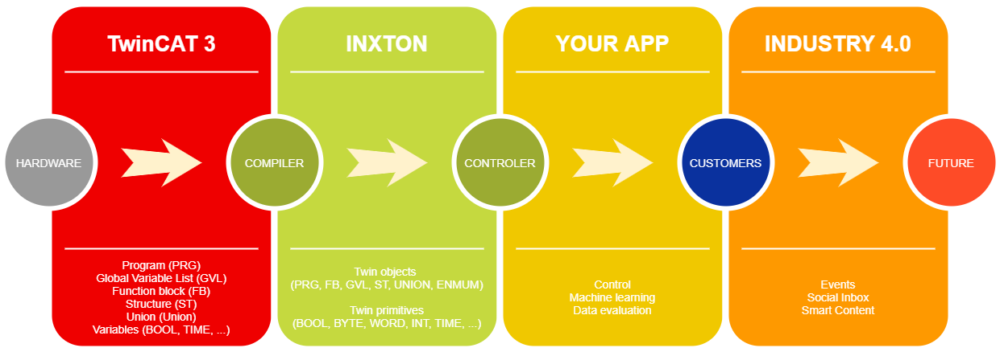

# Inxton.Package.Vortex.Core
Inxton.Package.Vortex.Core (Core) provides foundational tools and libraries for creating industrial applications in [Inxton.Vortex.Framework](https://github.com/Inxton/Inxton.Vortex.Framework).

## What's inside *Inxton.Package.Vortex.Core* package
Core package consists of several crucial components, these provide solid foundation for [Inxton.Vortex.Framework](https://github.com/Inxton/Inxton.Vortex.Framework).
- Compiler/Builder [Inxton.vortex.compiler.console](Inxton.vortex.compiler.console/README.md)
- Communication libraries [Inxton.Vortex.Connector](Inxton.Vortex.Connector/README.MD)

In few sentences, Compiler parses your TwinCAT 3 project and converts it into Connector project. Connector will provides you access to your PLC project from Inxton application via Communication libraries. 

## Pre-Requisites

Inxton is heavy lifting tool without having extreme requirements.
Before you start building your fist app please make sure you meet all pre-requisites listed bellow. If you are missing any of pre-requisites please install them in elisted order. All neccessary tools are free and enlisted with relevant redirects to download locations .

You can watch short installation video instruction [here](PREREQUISITES.MD).

## Installing licence

To run your Inxton application you need to have valid licence. Preview licence file is provided completly free of charge. 
It's simple, just grab it by following these steps. 

Easy installation steps:
1. Dowload **Licence.xml** file from github environment [here](http://bit.ly/future_of_automation) or as raw format [here](https://bit.ly/2w8nFbT).
2. Don't forget to save licence as **.xml** file.
3. Copy/Move licence into **'C:\Inxton\Licence.xml'** folder.

> **Note:** *Preview licence is valid until 2020-SEPT-01. Don't worry, you should be fine, full release is comming out at July 2020.*

## Installation

Checkout the installation procedure as easy instruction video [here](INSTALLATION.MD)

## Getting started
There are few options how to get started with Inxton. Poject can be created from scratch so you will discover all bells and whistles or you can simply grab one of our examples and enter into Inxton world more easier way.
### Exploring examples

Easiest way to get started is to use the examples and templates from [this repository](https://github.com/Inxton/Examples-Inxton.Package.Vortex.Core/).

### Creating new project

How to get started with new project see [here](Inxton.vortex.compiler.console/README.md)

See also

* [Inxton.Vortex.Connector](Inxton.Vortex.Connector/README.MD)
* [Inxton.Vortex.Compiler](Inxton.vortex.compiler.console/README.md)

